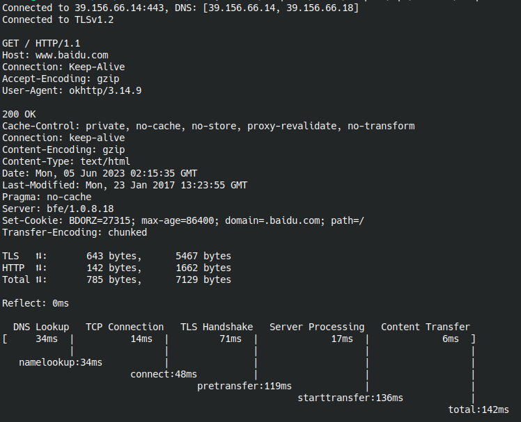

# httpstat-kt



## Usage

We know that Android system using app_process (or app_process64 for 64 bit) to run your Java code. Here httpstat-kt is a Java program with Main class rather than Android Activities. You can use my another tool [arun](https://github.com/ClarkGuan/arun) which is a Golang program to run it:

```shell
# install arun to you $GOPATH/bin
go install github.com/ClarkGuan/arun@latest

# build httpstat-release-unsigned.apk
./gradlew assembleRelease

# using arun to run you APK file on your device
arun ./httpstat/build/outputs/apk/release/httpstat-release-unsigned.apk com.httpstat.kotlin.MainKt https://www.baidu.com/
```
